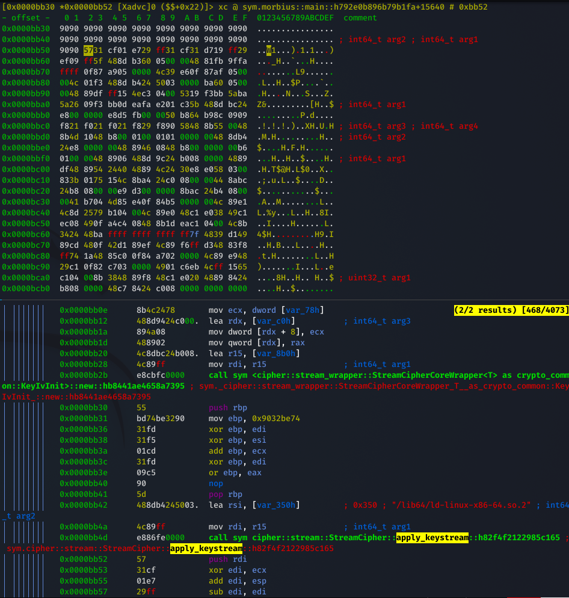
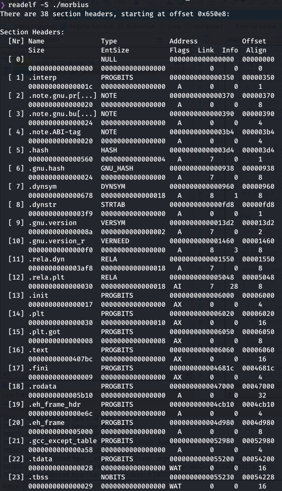
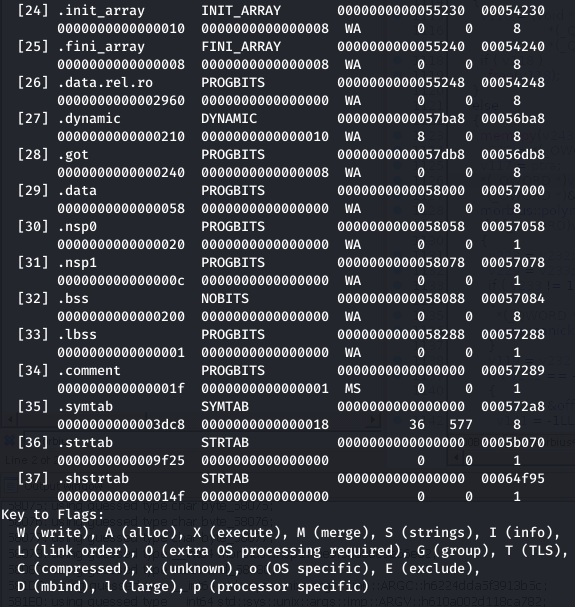
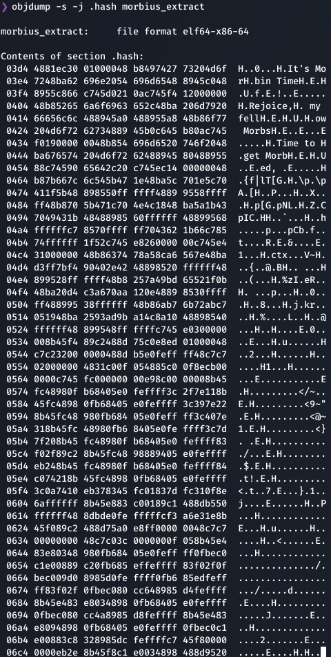
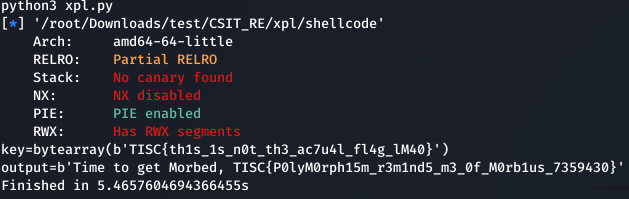

# Morbed, Morphed, Morbed

Rust polymorphic shellcode loader with metamorphic junk byte insertion.

(Shellcode was rewritten because angr couldn't work against this)

## Description (public)

```text
The contents of a phishing email has been extracted:

There are several reasons I may deem you morbin-able to be worthy of being morbed. These include, but are not limited to:
I am very Morby
I see you being morbin-able

To prove that you are a morber, un-morb this file!
```

## Setup Guide

1. `dist/morbius` contains the initial unencrypted ELF build. Run `make release` at least once to self-encrypt the ELF build.

2. Ensure the byte contents of `objdump -s -j .lbss ./dist/morbius` is `01`.

3. Provide `morbius` in `dist/` to players

## Solution

One needs to be perceptive about the challenge title being related to `morph`. By checking the hash of the binary, it can be seen that it changes every run.

The ELF binary deletes itself, then decrypts and re-encrypts itself on runtime, and write into its initial path.
We can trace where the binary re-encrypts itself, and make the binary decrypt and write itself by NOP-ing the encrypt function call. It can be inferred that the cipher rust package is used to encrypt and decrypt, where `cipher::stream::StreamCipher::apply_keystream` is the specific one used.

In the `morbius::main` function, the mentioned `apply_keystream` function call is called twice. This stream cipher is thus a symmetric cipher, where we just need to NOP the second function call so that the binary does not re-encrypt itself. (Compare [initial binary](xpl/res/morbius) with [rewritten binary](xpl/res/morbius_rewrite))



By comparing the binary after every run, there are certain regions in memory which are constantly changing. Some of these regions must be referenced in `morbius::main` to change them on runtime. A function `morbius::polymorphic::get_section` is recognised, which is called to retrieve the ELF sections. The function is complicated, thus there should be an easier way to find which sections are referenced.





By cross-referencing the last column values, i.e. section offsets, with the changing regions seen before, it is obvious which regions are referenced. The section offsets that align with the changing regions are the ones that are referenced, i.e. `.hash`, `.nsp0`, `.nsp1`.

As we have already NOP-ed the encrypt function call, by running the rewritten executable once, the static sections will be decrypted. (As seen in [ran binary](xpl/res/morbius_extract)) After checking the three sections referenced above, only `.hash` section will look to have plaintexts. To dump the `.hash` section, run `objcopy morbius_extract /dev/null --dump-section .hash=dump`.



Putting this dumped section in any disassembler will show that the dump file is a x86_64 linux shellcode. The shellcode pushes strings and arrays on the stack, and do the same functionalities as the original `morbius` binary. As such, the original binary is just a shellcode loader.

The shellcode uses the `write` syscall to print strings stored on the stack. Then, it reads 50 character input, and checks the input for invalid characters. If all the characters are numbers or range from `A to }`, the input characters are xor-ed with `47`. This xor-ed input buffer is then compared with a hex array. This can be easily reversed by xor-ing the hex array with `47` to give our correct input.

This will give an input of `TISC{th1s_1s_n0t_th3_ac7u4l_fl4g_lM40}`, which is 38 characters long. By inputting this as stdin, a different prompt is printed. At the end of the printed prompt, is a corrupted string. There are `50 - 38` more characters as our input, where one can realize that only two character positions (index 40 and 46) after the input prefix will change the printed corrupted string. The assembly also references these positions as a variable.

As such, we can create a bruteforce script given the previous alphanumeric character input conditions, to give the correct input.



## Flag

`TISC{P0lyM0rph15m_r3m1nd5_m3_0f_M0rb1us_7359430}`
